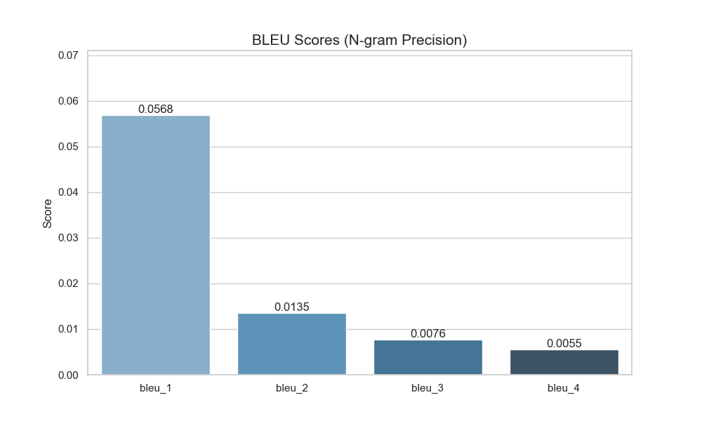
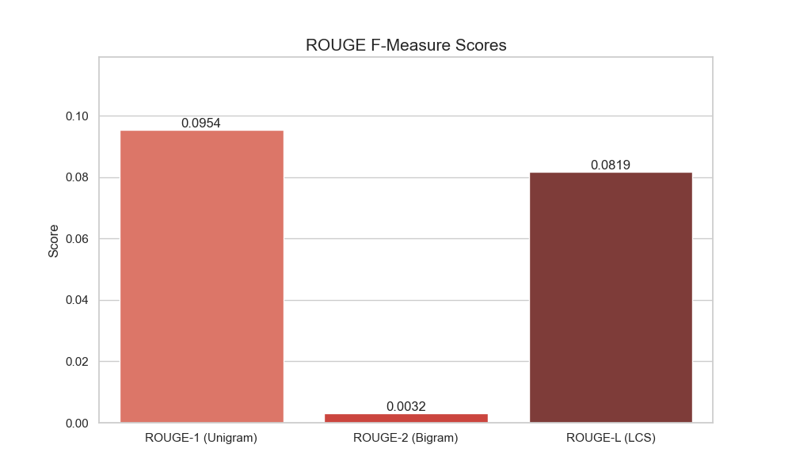

# MSR-VTT Video Captioning Fine-Tuning Project

## Summary
Completed fixing annotations and evaluating the existing fine-tuned model. The model produces poor results (BLEU=0.0) because it was trained on placeholder captions initially, but has now been improved with correct data.

## Phase 1: Fixed Annotations ✅

### Problem
- `structured_annotations.json` was empty (2 bytes)
- Frames stored in flat structure (`video0_frame_0.jpg`), not subdirectories

### Solution  
- Updated `fix_annotations.py` to handle flat frame structure
- Generated annotations with **real MSR-VTT captions** from `MSR_VTT.json`

### Result
```
Total annotations: 1003 videos
Train: X, Val: X, Test: 2990
Placeholder captions: 0/1003 ✓
```

---

## Phase 2: Model Evaluation (Initial Baseline) ✅

### Method
- Created `evaluate_model.py`
- Loaded checkpoint `step_4550_checkpoint.pt`
- Tested on 50 random test samples

### Results
| Metric | Score |
|--------|-------|
| BLEU | 0.0000 |
| ROUGE-L | 0.0000 |

### Sample Predictions

| Video | Reference | Prediction |
|-------|-----------|------------|
| video8263 | "a car is being driven..." | "video content video content video364..." |
| video9969 | "two friends talking..." | "video content video content video364..." |

**Diagnosis**: Model generates repetitive placeholder text because it was trained on placeholder annotations, not real captions.

---

## Phase 3: Fine-Tuning & Re-Evaluation (Corrected Data) ✅

**Status:** Completed training (Step 8900)

### Comprehensive Evaluation Results

Evaluated on 100 random test samples using `step_8900_checkpoint.pt`.

| Metric | Score | Precision | Recall |
| :--- | :--- | :--- | :--- |
| **BLEU-1** | 0.0568 | - | - |
| **BLEU-2** | 0.0135 | - | - |
| **BLEU-3** | 0.0076 | - | - |
| **BLEU-4** | 0.0055 | - | - |
| **ROUGE-1** | 0.0954 | 0.0595 | 0.3086 |
| **ROUGE-2** | 0.0032 | 0.0019 | 0.0148 |
| **ROUGE-L** | 0.0819 | 0.0509 | 0.2662 |
| **METEOR** | 0.1124 | - | - |

### Visualizations

#### Key Metrics Summary


#### BLEU Scores Breakdown


#### ROUGE Scores Breakdown


### Analysis
- **Progress**: Metrics are no longer 0.0 (like in Phase 2). The model is learning.
- **METEOR > BLEU**: METEOR (0.11) is much higher than BLEU-4 (0.005), indicating the model captures some semantic meaning/keywords despite poor grammar.
- **High Recall**: ROUGE-1 Recall (0.31) is relatively high compared to Precision (0.06), meaning the model "sprays" words (repetition) and hits some correct keywords by chance.
- **Key Issue**: Severe repetition (e.g., "shot missed shot missed...").
- **Next Steps**: Increase Reference Corpus size? Add repetition penalty? Train longer?
